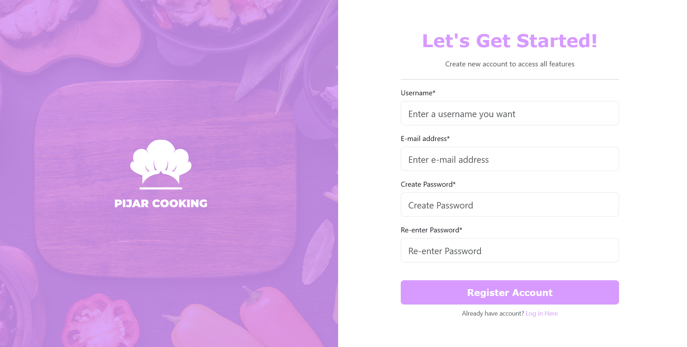
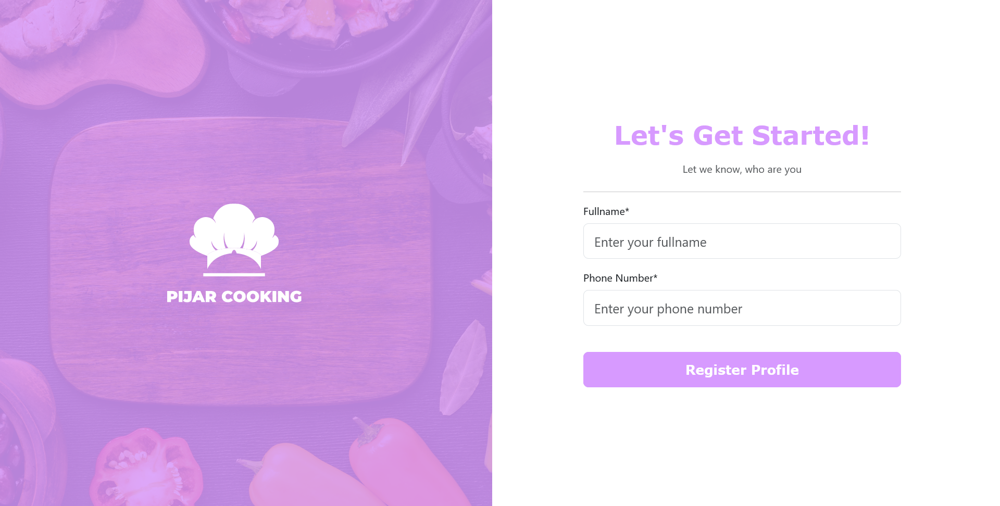
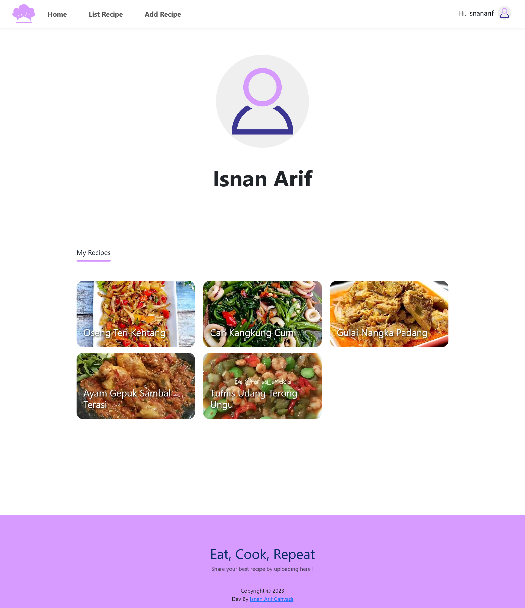
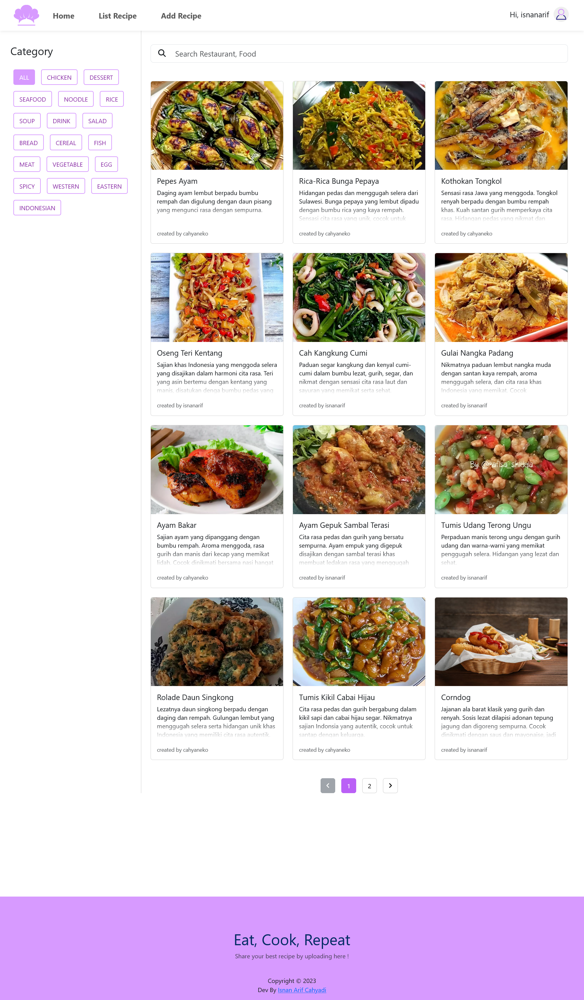

# Pijar Cooking Web ver

## Table of Contents

- [Introduction](#introduction)
- [Demo](#demo)
- [Technologies Used](#technologies-used)
- [Installation](#installation)
- [Configuration](#configuration)
- [Features](#features)
- [Screenshot](#screenshot)
- [Related Project](#related-project)
- [Authors and Contact Info](#authors-and-contact-info)

## Introduction

Pijar Cooking is a web-based application using React JS technology and also has a mobile-based application using React Native that is connected to a backend system and the same database so that users can choose to use the web or mobile versions of the application. Pijar Cooking is aimed at young people, both men and women, who want to learn to cook and want to share the dishes and recipes they have found or learned with everyone. Not only that, Pijar Cooking can be used by mothers who want to cook for their beloved family so that there will be warmth and harmony in the family. Presented with a family friendly user interface that looks fun and navigation that is easy for both young people and mothers to use. Accompanied by video tutorials to make cooking sessions much more fun and clear. There is a chat feature with fellow users available on the mobile version with the aim that fellow users can interact by simply saying hello, giving direct appreciation for recipes that have been made, or asking for assistance.

## Demo

Visit the link below for demo.

- :globe_with_meridians: [Pijar Cooking Webiste Demo](https://pijar-cooking-web-v3.vercel.app/)
- :link: [Pijar Cooking API Demo](https://pijar-cooking-api-v2-production.up.railway.app/)

## Technologies Used

The project utilizes the following technologies and libraries:

- React.js: A popular JavaScript library for building user interfaces, used as the core frontend framework.
- Node.js: The JavaScript runtime that powers the server-side backend.
- Axios: A promise-based HTTP client for making API requests from the frontend.
- Bootstrap 5: A responsive CSS framework for creating modern and visually appealing designs.
- Firebase: A cloud-based platform for building and hosting the backend and authentication services.
- Sass: A CSS preprocessor for easier and more organized styling.
- Redux: A state management library to efficiently manage application state.
- React Hook Form: A library for handling form validation and form state in React applications.

## Installation

1. Clone this repository to your local machine:

```bash
git clone https://github.com/isnancahyadi/pijar-cooking-web-v3.git
cd pijar-cooking-web-v3
```

2. Install the required dependencies using npm or yarn:

```bash
npm install
# or
yarn install
```

## Configuration

Before running the application, you need to set up the configuration for Firebase authentication and API from backend. Create a .env file in the root directory of the project and add the following environment variable:

```bash
REACT_APP_BACKEND_API=your_backend_api

REACT_APP_FIREBASE_API_KEY=your_firebase_api_key
```

## Features

- User Authentication: Allow users to sign up, log in, and manage their profiles.
- Recipe Browsing: Users can browse a list of recipes and view recipe details.
- Recipe Creation: Users can create and publish their own recipes.
- Recipe Search: Users can search for recipes based on specific recipe keywords.
- Responsive Design: The application is responsive and adapts to various screen sizes.

## Screenshot

<table>
    <tr>
        <td>1. Register Account Page</td>
        <td>2. Register Profile Page</td>
        <td>3. Login Page</td>
    </tr>
    <tr>
        <td>
            
        </td>
        <td>
            
        </td>
        <td>
            
        </td>
    </tr>
    <tr>
        <td>4. Profile Page</td>
        <td>5. Home Page</td>
        <td>6. List Recipes Page</td>
    </tr>
    <tr>
        <td>
            
        </td>
        <td>
            
        </td>
        <td>
            
        </td>
    </tr>
    <tr>
        <td>7. Detail Recipe Page</td>
        <td>8. Add Recipe Page</td>
    </tr>
    <tr>
        <td>
            
        </td>
        <td>
            
        </td>
    </tr>
</table>

## Related Project

- :iphone: [Pijar Cooking Mobile ver](https://github.com/isnancahyadi/pijar-cooking-mobile)
- :link: [Pijar Cooking API](https://github.com/isnancahyadi/pijar-cooking-api-v2)

## Authors and Contact Info

For more information about this project or have any question or need help for development, feel free to contact me.

Isnan Arif Cahyadi

<div id="badges">
  <a href="https://www.linkedin.com/in/isnanarifcahyadi/">
    
  </a>
  <a href="mailto:isnan.arifc@gmail.com">
    
  </a>
</div>
